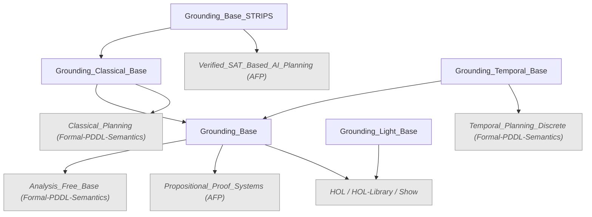
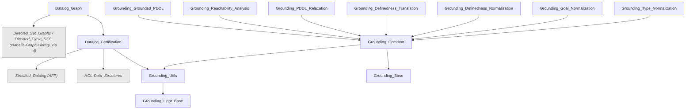

# Session dependencies

Generated from the `ROOT` files (`ROOTS` lists every session directory), which stay authoritative.
Each arrow is a session dependency — the parent session (`session X = Y +`) and every entry in `X`'s
`sessions` clause. External sessions (Formal-PDDL-Semantics, the AFP entries, the graph library) are
greyed out. Last updated 2026-08-06.

## Base spine

`Grounding_Base` is the expensive heap to keep warm; `Grounding_Classical_Base` (via
`Classical_Planning`) is what pulls the heavy continuous/ODE tower, and SAT lives only in
`Grounding_Base_STRIPS`.

## Reusable tree — `Grounding_Common/`

The stage sessions above hold the AST-agnostic half of each stage; the datalog branch is PDDL-free,
with the graph library isolated to `Datalog_Graph`.

## Classical tree — `Classical_Grounding/`

```mermaid
flowchart TD
    Classical_Grounding_Utils --> Grounding_Classical_Base
    Classical_Grounding_Utils --> Grounding_Common
    Classical_Grounding_Utils --> Grounding_Utils
    Grounding_Classical_Common --> Classical_Grounding_Utils
    Grounding_Classical_Common --> Grounding_Common

    Classical_Type_Normalization --> Grounding_Classical_Common
    Classical_Type_Normalization --> Grounding_Type_Normalization
    Classical_Goal_Normalization --> Grounding_Classical_Common
    Classical_Goal_Normalization --> Grounding_Goal_Normalization
    Classical_Precondition_Normalization --> Grounding_Classical_Common
    Classical_Definedness_Normalization --> Grounding_Classical_Common
    Classical_Definedness_Normalization --> Grounding_Definedness_Normalization
    Classical_Definedness_Translation --> Grounding_Classical_Common
    Classical_Definedness_Translation --> Grounding_Definedness_Translation
    Classical_PDDL_Relaxation --> Grounding_Classical_Common
    Classical_PDDL_Relaxation --> Grounding_PDDL_Relaxation
    Classical_Variable_Freeness --> Grounding_Classical_Common

    Classical_Grounded_PDDL --> Grounding_Classical_Common
    Classical_Grounded_PDDL --> Grounding_Grounded_PDDL
    Classical_Grounded_PDDL --> Classical_Variable_Freeness

    Classical_Reachability_Analysis --> Grounding_Classical_Common
    Classical_Reachability_Analysis --> Grounding_Reachability_Analysis
    Classical_Reachability_Analysis --> Datalog_Certification
    Classical_Reachability_Analysis --> Classical_Grounded_PDDL
    Classical_Reachability_Analysis --> Classical_PDDL_Relaxation

    Classical_Grounding --> Grounding_Classical_Common
    Classical_Grounding --> Grounding_Base_STRIPS
    Classical_Grounding --> Datalog_Certification
    Classical_Grounding --> Datalog_Graph
    Classical_Grounding --> Classical_Type_Normalization
    Classical_Grounding --> Classical_Goal_Normalization
    Classical_Grounding --> Classical_Precondition_Normalization
    Classical_Grounding --> Classical_Definedness_Normalization
    Classical_Grounding --> Classical_Definedness_Translation
    Classical_Grounding --> Classical_PDDL_Relaxation
    Classical_Grounding --> Classical_Variable_Freeness
    Classical_Grounding --> Classical_Grounded_PDDL
    Classical_Grounding --> Classical_Reachability_Analysis
```

`Classical_Grounding` (the top session) carries the pipelines, the STRIPS conversion, code setup and
the running examples; it is the session to build for the whole pipeline.

## Temporal tree — `Temporal_Grounding/` (draft)

Same shape as the classical tree, one level over `Grounding_Temporal_Base`: `Temporal_Grounding_Utils`
→ `Grounding_Temporal_Common` → the per-stage `Temporal_<Stage>` sessions (each also on its
`Grounding_<Stage>` reusable half) → the top `Temporal_Grounding`. There is no STRIPS/SAT layer, and
`Temporal_Reachability_Analysis` additionally depends on `Datalog_Certification`,
`Temporal_Grounded_PDDL` and `Temporal_PDDL_Relaxation`.
