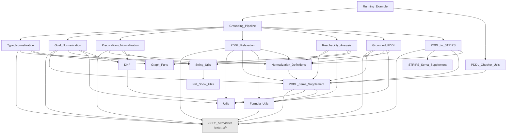

# Import Dependencies

```mermaid
graph TD
    PDDL_Semantics["PDDL_Semantics\n(external)"]:::external

    Running_Example --> Grounding_Pipeline
    Running_Example --> PDDL_Checker_Utils

    Grounding_Pipeline --> Type_Normalization
    Grounding_Pipeline --> Goal_Normalization
    Grounding_Pipeline --> Precondition_Normalization
    Grounding_Pipeline --> PDDL_Relaxation
    Grounding_Pipeline --> Reachability_Analysis
    Grounding_Pipeline --> Grounded_PDDL
    Grounding_Pipeline --> PDDL_to_STRIPS

    PDDL_Checker_Utils --> PDDL_Sema_Supplement

    Type_Normalization --> PDDL_Semantics
    Type_Normalization --> Normalization_Definitions
    Type_Normalization --> Graph_Funs
    Type_Normalization --> String_Utils

    Goal_Normalization --> PDDL_Semantics
    Goal_Normalization --> PDDL_Sema_Supplement
    Goal_Normalization --> String_Utils
    Goal_Normalization --> Utils
    Goal_Normalization --> DNF

    Precondition_Normalization --> PDDL_Semantics
    Precondition_Normalization --> Normalization_Definitions
    Precondition_Normalization --> String_Utils
    Precondition_Normalization --> DNF

    PDDL_Relaxation --> PDDL_Semantics
    PDDL_Relaxation --> Utils
    PDDL_Relaxation --> PDDL_Sema_Supplement
    PDDL_Relaxation --> Formula_Utils
    PDDL_Relaxation --> Normalization_Definitions

    Reachability_Analysis --> PDDL_Sema_Supplement
    Reachability_Analysis --> Normalization_Definitions
    Reachability_Analysis --> Formula_Utils
    Reachability_Analysis --> Graph_Funs
    Reachability_Analysis --> String_Utils

    Grounded_PDDL --> PDDL_Semantics
    Grounded_PDDL --> PDDL_Sema_Supplement
    Grounded_PDDL --> Normalization_Definitions
    Grounded_PDDL --> Utils
    Grounded_PDDL --> String_Utils

    PDDL_to_STRIPS --> PDDL_Semantics
    PDDL_to_STRIPS --> STRIPS_Sema_Supplement
    PDDL_to_STRIPS --> PDDL_Sema_Supplement
    PDDL_to_STRIPS --> Normalization_Definitions

    PDDL_Sema_Supplement --> PDDL_Semantics
    PDDL_Sema_Supplement --> Utils
    PDDL_Sema_Supplement --> Formula_Utils

    Normalization_Definitions --> PDDL_Sema_Supplement

    DNF --> Formula_Utils

    Formula_Utils --> PDDL_Semantics

    String_Utils --> Nat_Show_Utils

    classDef external fill:#e8e8e8,stroke:#999,color:#555,font-style:italic
    class PDDL_Semantics external
```
